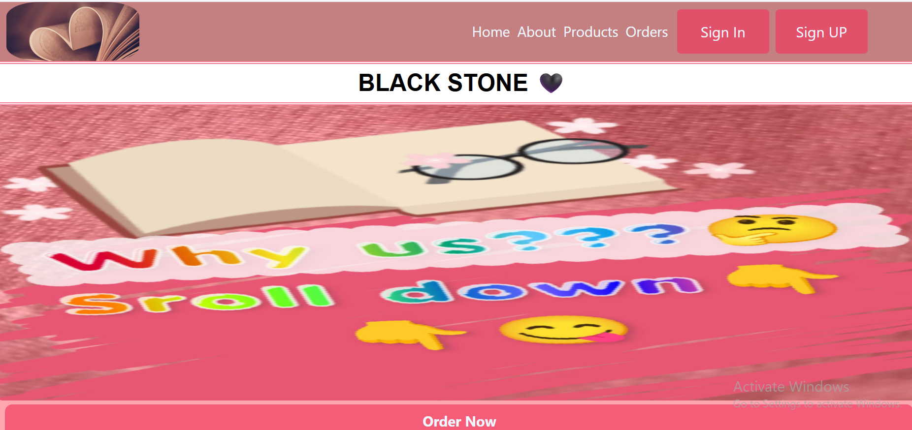

# Novel Shop

A **frontend project** showcasing a responsive layout and elegant design for a novel shop.  
Built using **HTML, CSS, and Bootstrap**, it includes a clean navigation bar, deals section, and responsive design for different screen sizes.

---

## Features

- Responsive header with logo, navigation menu, and buttons
- Deals section showcasing books in an elegant grid layout
- Footer with social media icons
- Clean and modern UI using **Bootstrap** and custom CSS

---

## Technologies Used

- **HTML5**
- **CSS3**
- **Bootstrap 5**

---

## 📸 Screenshot



---

## Project Setup

Clone the repository:

```bash
git clone https://github.com/HifzaSethi/Novel-shop.git
```
